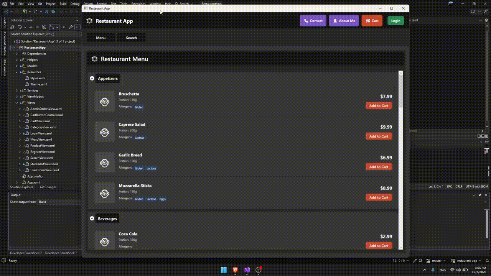
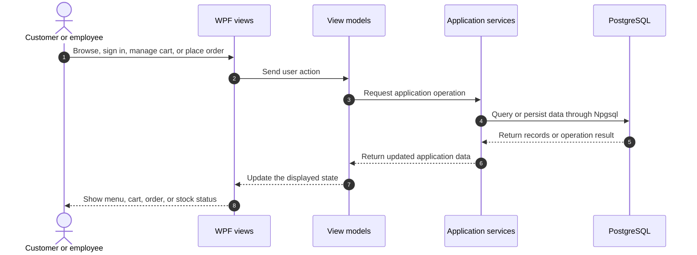

<div align="center">

# Restaurant App

**A Windows desktop restaurant app for browsing a menu, placing orders, and managing restaurant operations from one place**

[](https://www.microsoft.com/windows)
[](https://dotnet.microsoft.com/)
[](https://learn.microsoft.com/dotnet/csharp/)
[](LICENSE.txt)

</div>

<p align="center">
  
</p>

---

## 📌 Problem & Motivation

Restaurant ordering and day-to-day operations involve several connected tasks: keeping a menu organized, tracking orders, and monitoring stock. Switching between separate workflows makes it harder for customers and staff to find the information they need.

**Restaurant App** brings those workflows together in a Windows desktop application:

- **Customer ordering:** Browse products and categories, build a cart, and place orders.
- **Persistent data:** Store products, users, carts, and orders in PostgreSQL.
- **Restaurant operations:** Give employees access to order management and low-stock alerts.

## ✨ Key Features

- **🍽️ Browses** products and menus by category, with search and allergen information.
- **🛒 Persists** a signed-in customer's cart and calculates delivery fees and eligible discounts.
- **📦 Tracks** customer orders and lets employees review and update order status.
- **🔔 Highlights** products below a configurable stock threshold for staff.
- **🔐 Supports** customer registration and sign-in, with separate customer and employee experiences.

## 🧠 Architecture & How It Works

The WPF interface presents the customer and staff workflows. Views and view models call application services, which use Npgsql to query and update PostgreSQL.



## 🛠️ Tech Stack

| Category | Technology | Purpose |
| --- | --- | --- |
| Frontend / client | WPF | Windows desktop interface built with XAML |
| Language & runtime | C# / .NET 8 | Application logic and Windows desktop runtime |
| State / architecture | View models and application services | Separates UI workflows from data access |
| Database access | Npgsql 9.0.3 | PostgreSQL connectivity and parameterized SQL |
| Database | PostgreSQL | Stores users, products, menus, carts, and orders |
| Deployment / target | Windows desktop | Runs locally as a .NET WPF application |

## 🚀 Getting Started

### Prerequisites

- **Operating system:** Windows.
- **Runtime / IDE:** .NET 8 SDK, or Visual Studio 2022 version 17.8 or later with the **.NET desktop development** workload.
- **Database:** A running PostgreSQL server. Initialize it with `psql` or pgAdmin.
- **Package restore:** Internet access to restore NuGet packages.

### 1. Get the source

**PowerShell**

```powershell
git clone https://github.com/coxteen/restaurant-app.git
Set-Location restaurant-app
```

**Bash**

```bash
git clone https://github.com/coxteen/restaurant-app.git
cd restaurant-app
```

### 2. Create and initialize PostgreSQL

Create an empty database named `restaurant_database`, then run [`database.txt`](database.txt) against it. The script creates the application tables (including `cart_items`), indexes, and sample data.

> ⚠️ `database.txt` drops and recreates application tables before seeding them. Run it only against a new or disposable development database; existing data in those tables will be destroyed.

**PowerShell**

```powershell
createdb restaurant_database
psql -d restaurant_database -f .\database.txt
```

**Bash**

```bash
createdb restaurant_database
psql -d restaurant_database -f ./database.txt
```

Alternatively, create the database in pgAdmin, open its **Query Tool**, load `database.txt`, and execute the script.

The seed script includes sample employee and customer accounts. Use them only for local development, and replace or remove them before using the database elsewhere.

### 3. Set the database connection

Update the `RestaurantDB` connection string in [`RestaurantApp/App.config`](RestaurantApp/App.config) with your local PostgreSQL credentials:

```xml
<connectionStrings>
  <add name="RestaurantDB"
       connectionString="Host=localhost;Port=5432;Database=restaurant_database;Username=YOUR_USERNAME;Password=YOUR_LOCAL_PASSWORD"
       providerName="Npgsql" />
</connectionStrings>
```

`App.config` is the application's configuration source; this project does not use a `.env` file. Never commit real database passwords.

### 4. Build and run in Visual Studio

1. Install Visual Studio 2022 (17.8 or later) with the **.NET desktop development** workload and .NET 8 SDK.
2. Open `RestaurantApp.sln`.
3. In Solution Explorer, right-click `RestaurantApp` and select **Set as Startup Project** if needed.
4. Wait for NuGet restore to finish. If packages are not restored automatically, right-click the solution and select **Restore NuGet Packages**.
5. Press **F5** to build and run with the debugger, or **Ctrl+F5** to run without debugging.

### Run from the command line (optional)

**PowerShell**

```powershell
dotnet restore .\RestaurantApp.sln
dotnet run --project .\RestaurantApp\RestaurantApp.csproj
```

**Bash**

```bash
dotnet restore ./RestaurantApp.sln
dotnet run --project ./RestaurantApp/RestaurantApp.csproj
```

## ⚙️ Configuration

Application behavior and order-pricing thresholds are defined in the `<appSettings>` section of [`RestaurantApp/App.config`](RestaurantApp/App.config):

| Setting | Current value | Purpose |
| --- | ---: | --- |
| `MenuDiscountPercentage` | `10` | Configured menu discount percentage; it is not currently applied by the order-pricing service |
| `MinimumOrderForFreeDelivery` | `50` | Subtotal at which delivery becomes free |
| `DeliveryFee` | `5` | Fee applied below the free-delivery threshold |
| `MinimumOrderForDiscount` | `100` | Subtotal that qualifies for an order discount |
| `OrderDiscountPercentage` | `5` | Order or loyalty discount percentage |
| `OrderCountForLoyaltyDiscount` | `5` | Recent non-cancelled orders required for the loyalty discount |
| `DaysForLoyaltyDiscountPeriod` | `30` | Lookback period for counting loyalty orders |
| `LowStockThreshold` | `5` | Quantity below which a product appears in stock alerts |

Change the values in `App.config` to adjust the defaults for your local build.

## 📄 License & Author

- **Author:** [Costin Ghiujan](https://github.com/coxteen)
- **License:** MIT. See [`LICENSE.txt`](LICENSE.txt).
